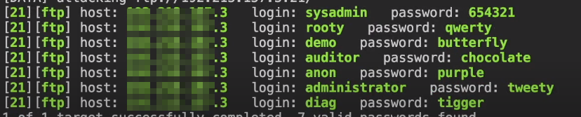
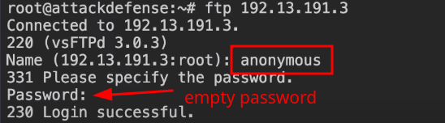

:::note
Default port: **21**
:::

### Enum

```bash
nmap $IP -p 21 -sV -O
```

### Bruteforce with Hydra


```shell
hydra -L /usr/share/metasploit-framework/data/wordlists/unix_users.txt -P /usr/share/metasploit-framework/data/wordlists/unix_passwords.txt $IP ftp
```




### Bruteforce with Nmap


```shell
nmap $IP --script ftp-brute --script-args userdb=/path/to/users -p 21
```


## Anonymous Login

```bash
nmap $IP --script ftp-anon
```


