## Deploy with Docker

```bash
docker run -d --name nessus -p 8080:8834 tenableofficial/nessus:latest
```

Open [https://localhost:8080/ ](https://0.0.0.0:8080/#/)on your browser

\-> Select Nessus Essentials

\-> Make and account or use your own activation code / credentials


## Make a simple scan

New Scan -> Basic Network Scan -> Fill in the name and target

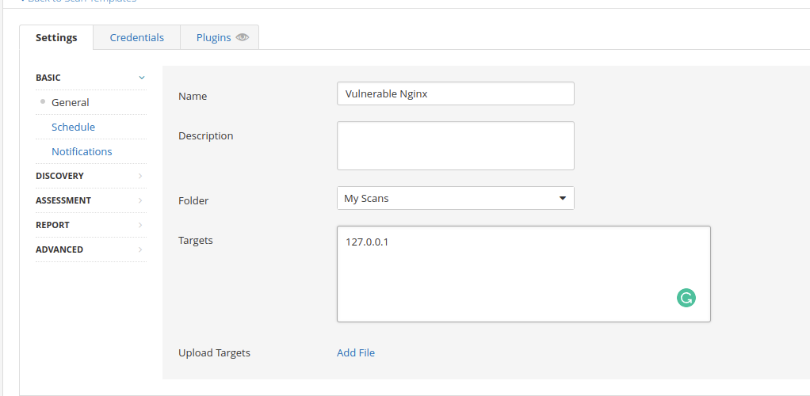

Discovery -> Select port scan (all ports) if necessary -> Save Scan

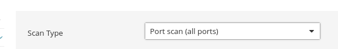

#### Run Scan

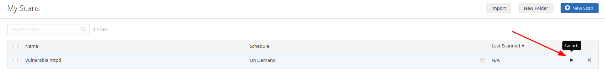

:::warning
The scan can take a long time to complete.&#x20;
:::

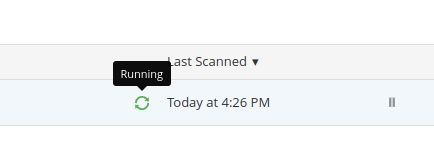

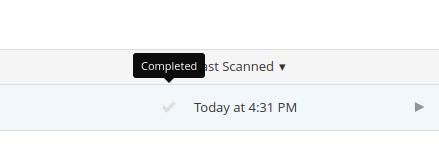

## Advanced Scan

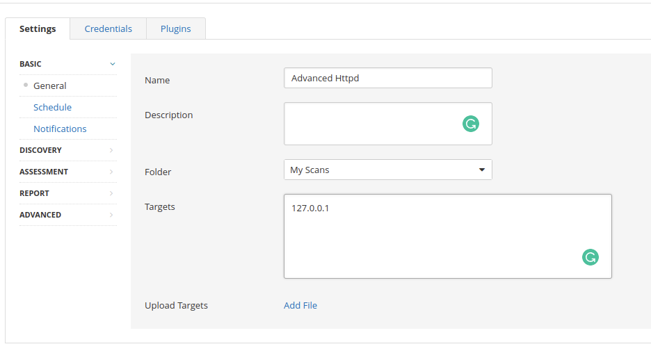

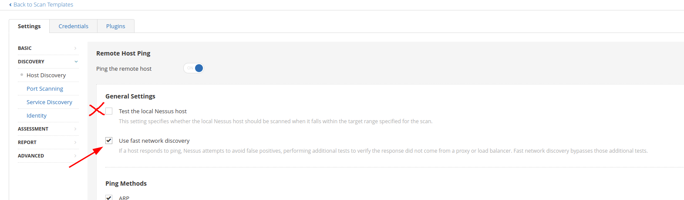

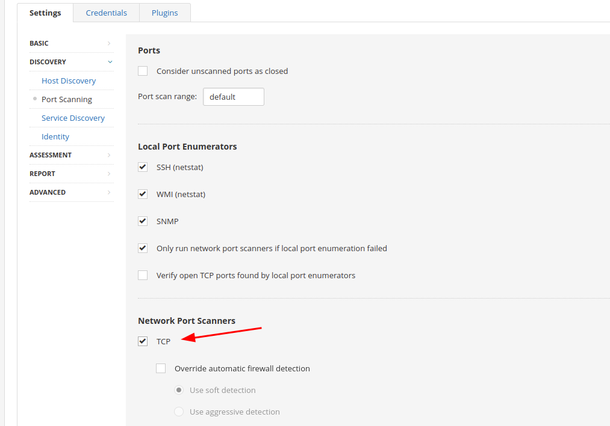

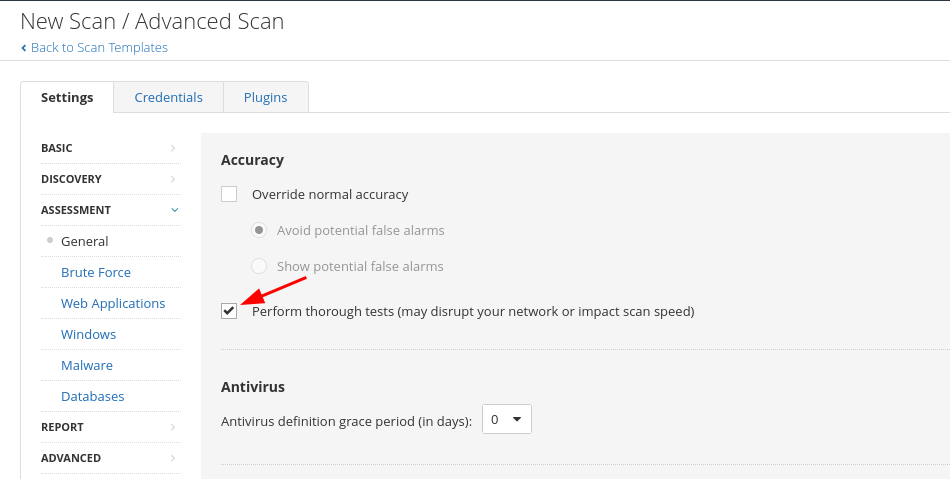

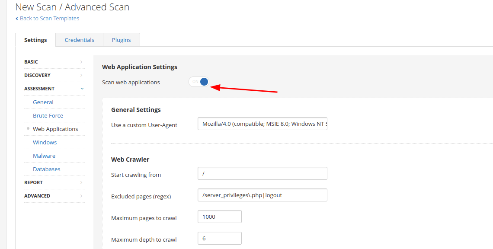

### Results

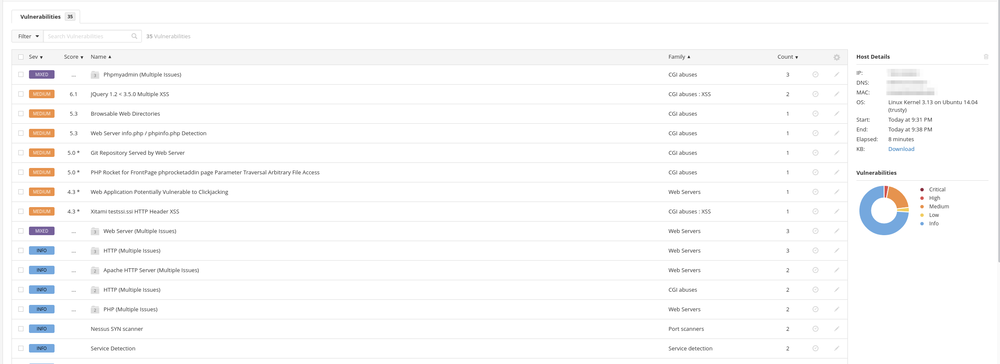

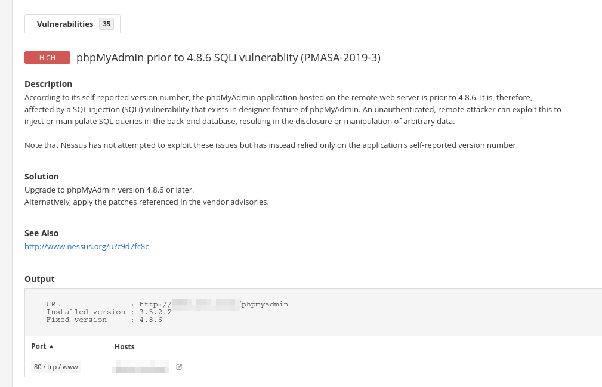

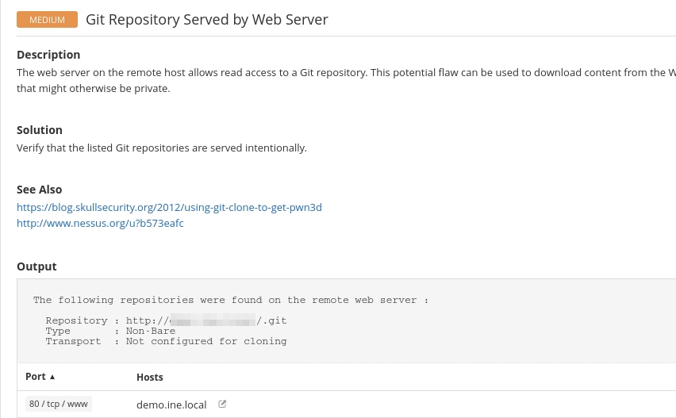

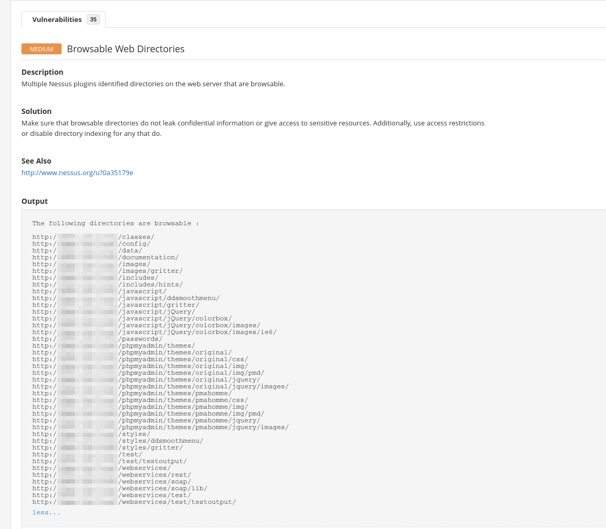
